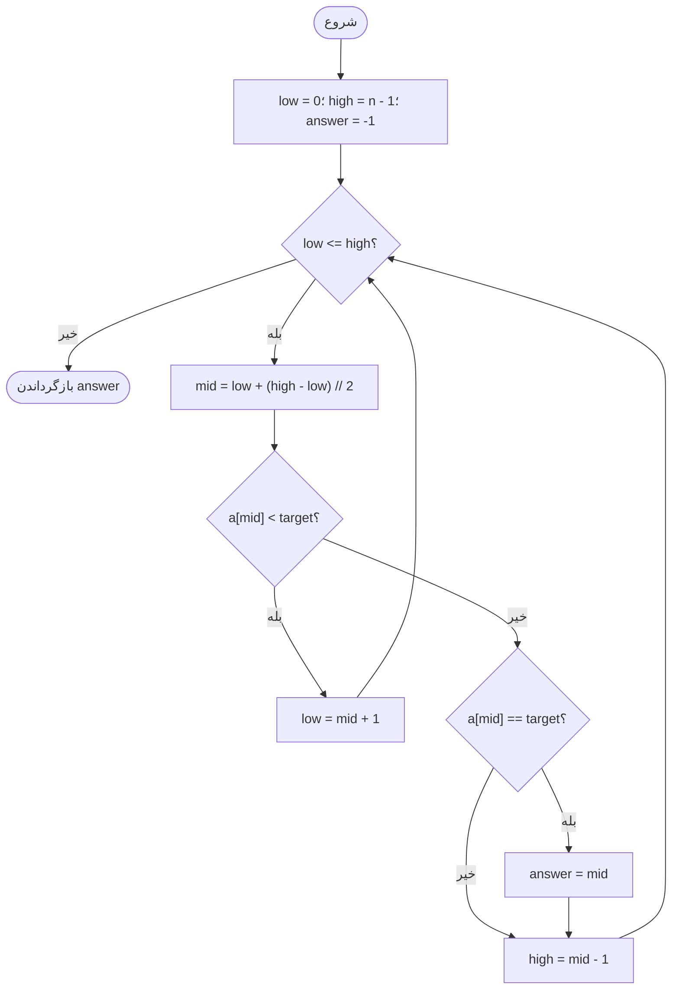
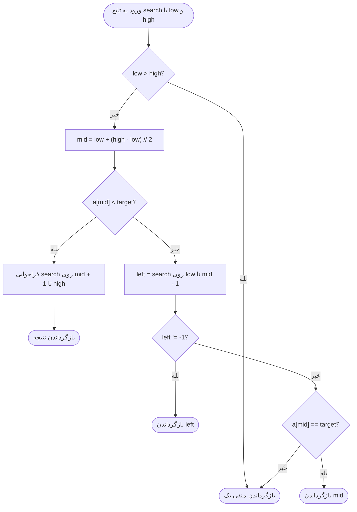
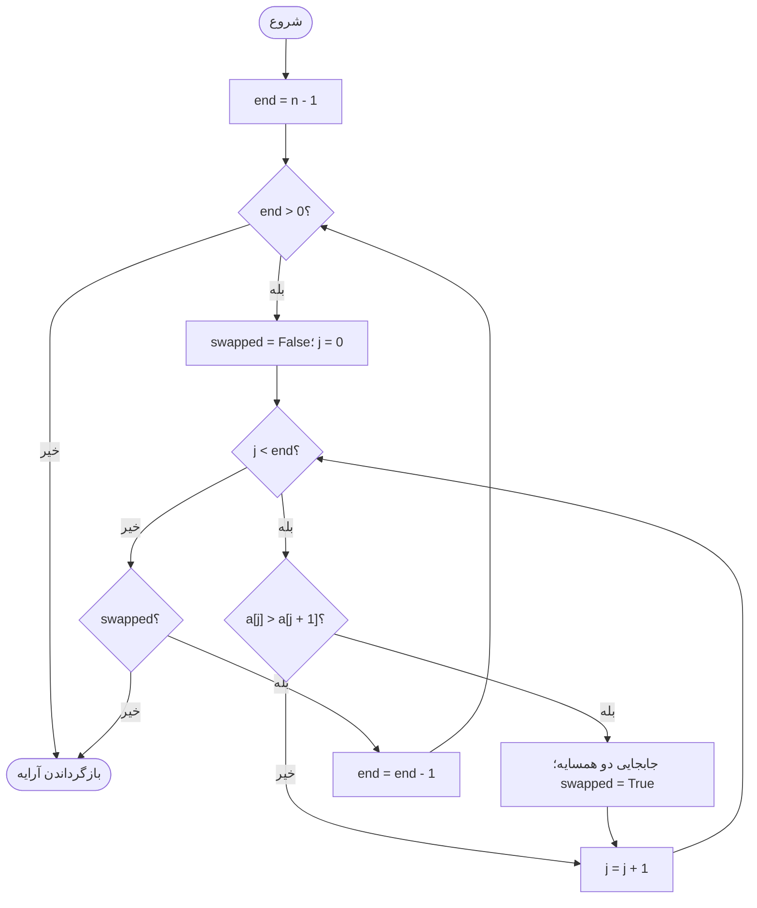
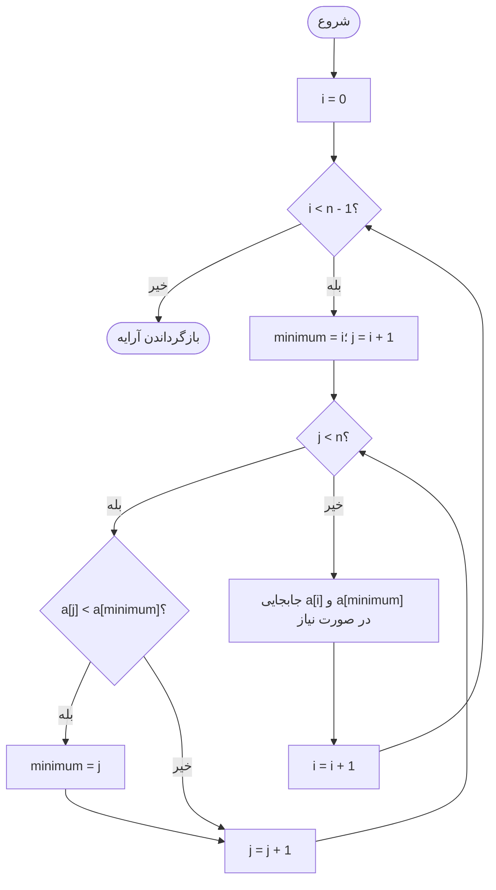
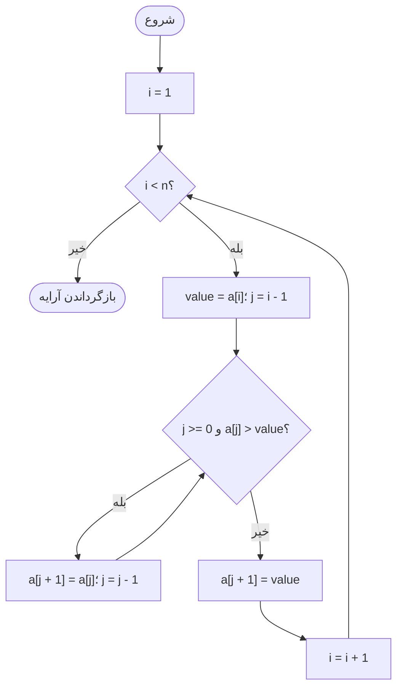
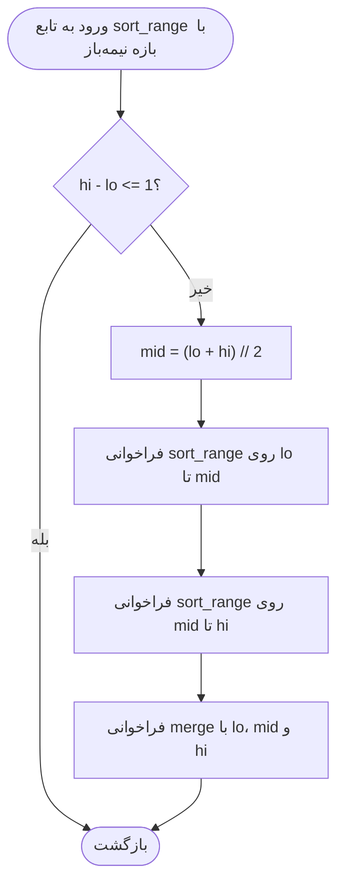
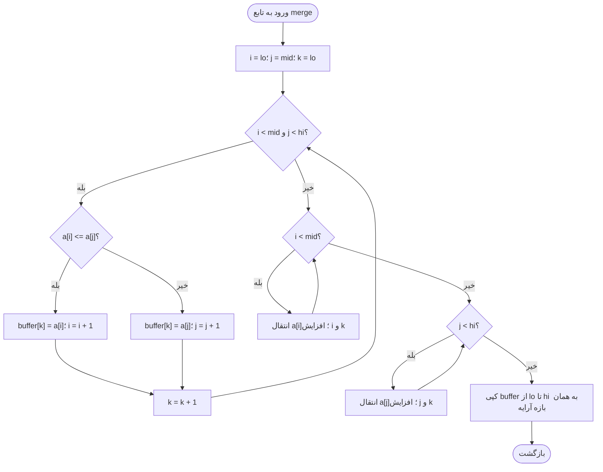
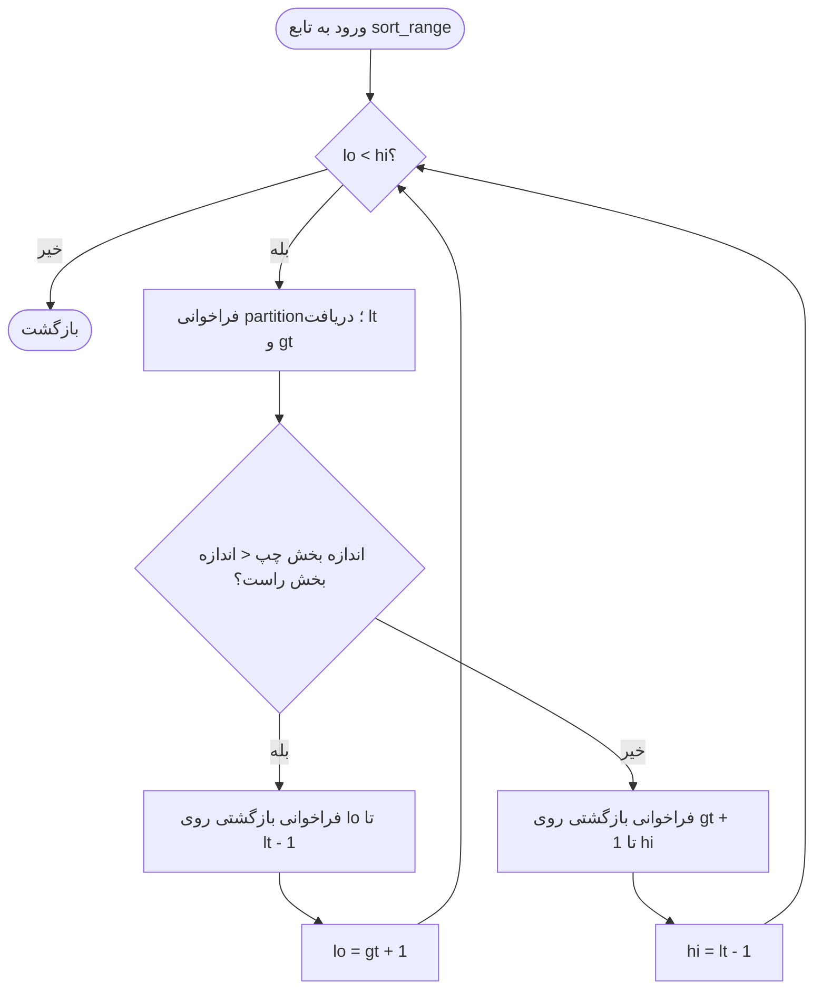
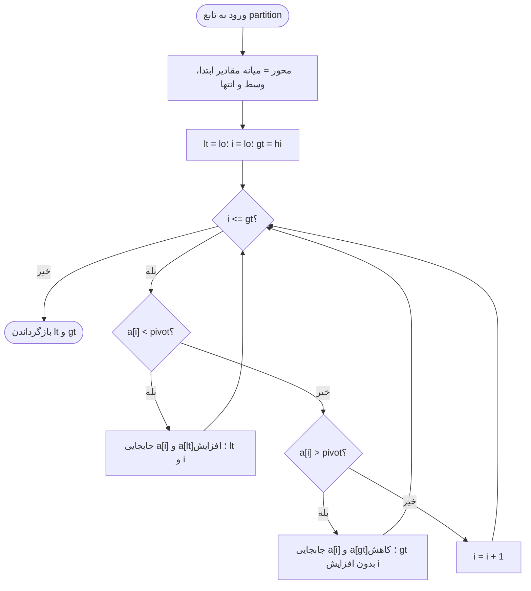

# تمرین‌های الگوریتم: جست‌وجو و مرتب‌سازی

این مجموعه برای دانشجوی درس الگوریتم نوشته شده است. الگوریتم یعنی دنباله‌ای دقیق از گام‌ها برای حل مسئله. نوت‌بوک `algorithms_exercises.ipynb` کد قابل اجرا، ردگیری مراحل، آزمون‌های صحت و نمودارهای اندازه‌گیری واقعی را در کنار هم دارد.

بررسی اولیهٔ ریپو نشان داد شاخهٔ `main` تنها یک `README.md` با عنوان ریپو داشت؛ فایل دستورالعمل `AGENTS.md`، نوت‌بوک، وابستگی یا پیاده‌سازی قبلی وجود نداشت. همین دو فایل ریشهٔ ریپو تکمیل شده‌اند.

قراردادها: اندیس‌ها از صفر شروع می‌شوند؛ اعداد طبیعی در این تمرین شامل صفر هستند؛ مرتب‌سازی صعودی یعنی ترتیب نامنزولی و حفظ تعداد تکرارها. همهٔ مرتب‌سازی‌ها همان فهرست ورودی را تغییر می‌دهند و برمی‌گردانند. تغییر ورودی به‌تنهایی به معنی درجا بودن نیست؛ حافظهٔ کمکی نیز باید بررسی شود.

اصطلاحات پایه: پیچیدگی زمانی `Time Complexity` تعداد عملیات را با رشد اندازهٔ ورودی می‌سنجد؛ حافظهٔ کمکی `Auxiliary Space` فضای اضافی به‌جز خود ورودی است؛ نماد `Θ` کران رشد دقیق و نماد `O` کران بالای رشد را نشان می‌دهد. متغیر `n` تعداد اعضاست و لگاریتم‌ها در تحلیل نصف‌کردن بازه پایهٔ دو دارند. مقایسه و دسترسی به یک عضو را با هزینهٔ ثابت مدل می‌کنیم؛ برای عددهای صحیح بسیار بزرگ، هزینهٔ مقایسه به طول عدد هم وابسته است.

## تمرین اول: جست‌وجوی دودویی

ایدهٔ جست‌وجوی دودویی `Binary Search` این است که مقدار وسط یک بازهٔ مرتب را با هدف مقایسه کنیم و نیمی را که نمی‌تواند پاسخ را داشته باشد کنار بگذاریم. پیش‌شرط، مرتب بودن صعودی داده‌ها و امکان دسترسی مستقیم به اندیس است. برای ورودی نامرتب تضمین درستی نداریم؛ مرتب‌بودن را داخل هر جست‌وجو بررسی نمی‌کنیم، چون همان بررسی `Θ(n)` زمان می‌برد.

قرارداد پاسخ: اندیس **اولین رخداد** هدف برگردانده می‌شود و در صورت نبودن آن، پاسخ `-1` است. پس وقتی مقدار وسط برابر هدف است، آن اندیس را نامزد نگه می‌داریم و بازهٔ چپ را نیز جست‌وجو می‌کنیم. این انتخاب تکرارها را به‌صورت قطعی مدیریت می‌کند.

منطق درستی: ناوردای حلقه `Loop Invariant` می‌گوید اولین رخداد، اگر هنوز پیدا نشده باشد، باید در بازهٔ فعال قرار داشته باشد؛ نامزد ذخیره‌شده همواره یک رخداد واقعی است. وقتی مقدار وسط کوچک‌تر از هدف است، تمام اعضای قبل از آن نیز کوچک‌ترند. وقتی بزرگ‌تر یا برابر است، رخداد زودتر فقط در چپ ممکن است. هر گام طول بازه را کم می‌کند؛ پایان با نامزد معتبر یا نبودن هدف نتیجه می‌دهد. استدلال نسخهٔ بازگشتی همان است و شرط بازهٔ خالی، حالت پایه `Base Case` آن است.

### فلوچارت نسخهٔ تکراری



### فلوچارت نسخهٔ بازگشتی

توضیح تابع کمکی: فراخوانی نخست با کران صفر و آخرین اندیس انجام می‌شود. تابع `search` تنها کران‌ها را عوض می‌کند و کپی آرایه نمی‌سازد.



### مثال مرحله‌به‌مرحله

مثال، جست‌وجوی عدد ۱۲ در آرایهٔ زیر است؛ هر دو نسخه همین بازه‌ها را بررسی می‌کنند.

```text
[2, 4, 7, 9, 12, 12, 12, 16, 20]
```

| مرحله | کران چپ `low` | میانه `mid` | کران راست `high` | مقدار میانه | تصمیم |
|---|---:|---:|---:|---:|---|
| گام اول | 0 | 4 | 8 | 12 | ذخیرهٔ اندیس ۴ و ادامه در چپ |
| گام دوم | 0 | 1 | 3 | 4 | ادامه در راست با کران چپ ۲ |
| گام سوم | 2 | 2 | 3 | 7 | ادامه در راست با کران چپ ۳ |
| گام چهارم | 3 | 3 | 3 | 9 | بازه خالی می‌شود؛ پاسخ ۴ |

تحلیل زمان: طول بازه پس از هر گام تقریباً نصف می‌شود؛ حل رابطهٔ زیر زمان لگاریتمی می‌دهد. نسخهٔ معمولی که هر رخداد را می‌پذیرد، در صورت برابرشدن میانه می‌تواند زمان بهترین حالت ثابت داشته باشد. **در نسخهٔ اولین رخداد این مجموعه، جست‌وجو بعد از برابری ادامه می‌یابد** و برای ورودی غیرتهی با رشد `n`، بهترین، متوسط و بدترین زمان همگی `Θ(log(n + 1))` هستند. آرایهٔ خالی و تک‌عضوی زمان ثابت دارند.

```text
T(n) = T(floor(n / 2)) + Θ(1) = Θ(log(n + 1))
```

| نسخه | زمان با قرارداد اولین رخداد | حافظهٔ کمکی بدون ردگیری | علت حافظه |
|---|---|---|---|
| نسخهٔ تکراری | `Θ(log(n + 1))` | `Θ(1)` | چند متغیر ثابت |
| نسخهٔ بازگشتی | `Θ(log(n + 1))` | `Θ(log(n + 1))` | پشتهٔ فراخوانی |

بهینه‌سازی مستدل: استفاده از کران به‌جای برش آرایه از کپی‌های خطی جلوگیری می‌کند. تبدیل نسخهٔ بازگشتی به تکراری، حافظهٔ پشتهٔ فراخوانی `Call Stack` را از لگاریتمی به ثابت می‌رساند و سربار فراخوانی را حذف می‌کند؛ مرتبهٔ زمان همچنان لگاریتمی است و بهترشدن زمان عملی باید اندازه‌گیری شود. محاسبهٔ میانه با فاصلهٔ کران‌ها در زبان‌های با عدد ثابت از سرریز جلوگیری می‌کند؛ در `Python` عدد صحیح سرریز معمول ندارد و این فرمول ادعای سرعت بیشتر ندارد.

نکتهٔ هزینهٔ آماده‌سازی: اگر داده‌ها نامرتب باشند، مرتب‌سازی برای یک جست‌وجوی تنها معمولاً نسبت به جست‌وجوی خطی `Linear Search` هزینهٔ بیشتری دارد. برای تعداد زیادی جست‌وجو می‌توان هزینهٔ مرتب‌سازی یک‌باره را میان درخواست‌ها تقسیم کرد. پایین‌تررفتن از مرتبهٔ لگاریتمی در بدترین حالت مدل مقایسه‌ای، بدون فرض اضافی دربارهٔ داده‌ها ممکن نیست؛ شمار حالت‌های موقعیت پاسخ با هر مقایسه تنها با ضریب ثابت کاهش می‌یابد.

### بررسی حالت‌های مرزی

| حالت | ورودی | هدف | پاسخ |
|---|---|---:|---:|
| آرایهٔ خالی | `[]` | 1 | -1 |
| آرایهٔ تک‌عضوی موفق | `[5]` | 5 | 0 |
| آرایهٔ تک‌عضوی ناموفق | `[5]` | 2 | -1 |
| عنصر غایب | `[1, 3, 5]` | 4 | -1 |
| عناصر تکراری | `[1, 2, 2, 2, 3]` | 2 | 1 |
| اعضای یکسان | `[7, 7, 7, 7]` | 7 | 0 |

بررسی نوت‌بوک علاوه بر این حالت‌ها، تمام آرایه‌های نامنزولی تا طول شش روی پنج مقدار، و هدف‌های داخل و خارج دامنه را با مرجع خطی مقایسه می‌کند. فعال‌کردن ردگیری `Trace` برای نمایش مراحل، حافظهٔ اضافی لگاریتمی دارد و جزو تحلیل نسخهٔ بدون ردگیری نیست.

## تمرین دوم: پنج الگوریتم مرتب‌سازی

تعریف پایداری `Stability` این است که ترتیب نسبی اعضای دارای کلید برابر حفظ شود؛ مثلاً دو دانشجو با نمرهٔ یکسان جای نسبی خود را از دست ندهند. تعریف درجا بودن `In-place` در `README.md`، مصرف حافظهٔ کمکی ثابت است و **پشتهٔ بازگشت را نیز حساب می‌کند**. بنابراین نسخهٔ سریع با بخش‌بندی در خود آرایه، در این تعریف سخت‌گیرانه کاملاً درجا نیست.

قرارداد پیاده‌سازی: توابع پنج‌گانه برای خود حل از `sorted()` یا `list.sort()` استفاده نمی‌کنند. استفاده از `sorted()` تنها برای ساخت ورودی مرتب آزمایش و مقایسه با پاسخ مرجع است. پارامتر اختیاری `trace` برای مثال‌های کوتاه است؛ جدول حافظه و زمان‌گیری مربوط به حالت خاموش آن است. ذخیرهٔ کپی کل آرایه در هر رویداد ردگیری، فضای بسیار بیشتری می‌گیرد و برای ورودی بزرگ مناسب نیست.

### مرتب‌سازی حبابی

ایدهٔ مرتب‌سازی حبابی `Bubble Sort` مقایسهٔ همسایه‌ها و جابجایی دو عضو با ترتیب نادرست است. در پایان هر گذر، بزرگ‌ترین عضو بازهٔ فعال به انتهای آن رسیده است؛ پس انتهای مرتب‌شده از مقایسه‌های بعدی حذف می‌شود. اگر هیچ جابجایی انجام نشود، کل آرایه مرتب است و توقف زودهنگام `Early Exit` درست است.



مثال مشترک با ورودی زیر شروع می‌شود؛ ردیف‌ها مستقیم از ردگیری پیاده‌سازی استخراج شده‌اند.

```text
[5, 2, 4, 2, 1]
```

| مرحله | رویداد | جزئیات | آرایه |
|---|---|---|---|
| گام 1 | گذر | `end=4` | `[2, 4, 2, 1, 5]` |
| گام 2 | گذر | `end=3` | `[2, 2, 1, 4, 5]` |
| گام 3 | گذر | `end=2` | `[2, 1, 2, 4, 5]` |
| گام 4 | گذر | `end=1` | `[1, 2, 2, 4, 5]` |

### مرتب‌سازی انتخابی

ایدهٔ مرتب‌سازی انتخابی `Selection Sort` انتخاب کوچک‌ترین عضو بخش باقی‌مانده و جابجایی آن با اولین خانهٔ آن بخش است. پس از گام شمارهٔ `i`، پیشوند آرایه شامل کوچک‌ترین اعضا به‌ترتیب درست است. تعداد مقایسه‌ها حتی برای آرایهٔ مرتب نیز درجهٔ دو است؛ تعداد جابجایی‌ها حداکثر `n - 1` است.



مثال مشترک با ورودی زیر شروع می‌شود؛ ردیف‌ها مستقیم از ردگیری پیاده‌سازی استخراج شده‌اند.

```text
[5, 2, 4, 2, 1]
```

| مرحله | رویداد | جزئیات | آرایه |
|---|---|---|---|
| گام 1 | انتخاب | `i=0; minimum=4` | `[1, 2, 4, 2, 5]` |
| گام 2 | انتخاب | `i=1; minimum=1` | `[1, 2, 4, 2, 5]` |
| گام 3 | انتخاب | `i=2; minimum=3` | `[1, 2, 2, 4, 5]` |
| گام 4 | انتخاب | `i=3; minimum=3` | `[1, 2, 2, 4, 5]` |

### مرتب‌سازی درجی

ایدهٔ مرتب‌سازی درجی `Insertion Sort` گسترش یک پیشوند مرتب است. عضو بعدی موقتاً نگه داشته می‌شود؛ اعضای بزرگ‌تر یک خانه به راست می‌روند و عضو در جای مناسب قرار می‌گیرد. چون اعضای برابر جابجا نمی‌شوند، پایداری حفظ می‌شود. هزینهٔ جابجایی‌ها با تعداد وارونگی `Inversion` رابطه دارد؛ وارونگی جفتی است که عضو سمت چپ بزرگ‌تر از عضو سمت راست باشد. زمان این نسخه `Θ(n + I)` است که `I` تعداد وارونگی‌هاست.



مثال مشترک با ورودی زیر شروع می‌شود؛ ردیف‌ها مستقیم از ردگیری پیاده‌سازی استخراج شده‌اند.

```text
[5, 2, 4, 2, 1]
```

| مرحله | رویداد | جزئیات | آرایه |
|---|---|---|---|
| گام 1 | درج | `i=1; destination=0` | `[2, 5, 4, 2, 1]` |
| گام 2 | درج | `i=2; destination=1` | `[2, 4, 5, 2, 1]` |
| گام 3 | درج | `i=3; destination=1` | `[2, 2, 4, 5, 1]` |
| گام 4 | درج | `i=4; destination=0` | `[1, 2, 2, 4, 5]` |

### مرتب‌سازی ادغامی

ایدهٔ مرتب‌سازی ادغامی `Merge Sort` روش تقسیم و حل `Divide and Conquer` است: بازه را نصف می‌کنیم، هر نیمه را مرتب می‌کنیم و دو نیمهٔ مرتب را با حرکت دو اشاره‌گر ادغام می‌کنیم. با استقرا، بازهٔ تک‌عضوی مرتب است و ادغام دو بازهٔ مرتب نیز بازهٔ مرتب با همان اعضا می‌سازد.

توضیح تابع‌ها: تابع `sort_range` بازه‌های نیمه‌باز را می‌گیرد، یعنی کران راست عضو بازه نیست؛ تابع `merge` دو نیمه را در یک بافر مشترک `Buffer` ادغام و سپس به آرایه منتقل می‌کند. در برابری، عضو نیمهٔ چپ اول انتخاب می‌شود. این نسخه پیش از ادغام، مرتب‌بودن دو نیمه نسبت به هم را بررسی نمی‌کند؛ بنابراین بهترین حالت آن هم خطی‌لگاریتمی است.





مثال مشترک با ورودی زیر شروع می‌شود؛ ردیف‌ها مستقیم از ردگیری پیاده‌سازی استخراج شده‌اند.

```text
[5, 2, 4, 2, 1]
```

| مرحله | رویداد | جزئیات | آرایه |
|---|---|---|---|
| گام 1 | تقسیم | `[0:5) at 2` | `[5, 2, 4, 2, 1]` |
| گام 2 | تقسیم | `[0:2) at 1` | `[5, 2, 4, 2, 1]` |
| گام 3 | ادغام | `[0:1) + [1:2)` | `[2, 5, 4, 2, 1]` |
| گام 4 | تقسیم | `[2:5) at 3` | `[2, 5, 4, 2, 1]` |
| گام 5 | تقسیم | `[3:5) at 4` | `[2, 5, 4, 2, 1]` |
| گام 6 | ادغام | `[3:4) + [4:5)` | `[2, 5, 4, 1, 2]` |
| گام 7 | ادغام | `[2:3) + [3:5)` | `[2, 5, 1, 2, 4]` |
| گام 8 | ادغام | `[0:2) + [2:5)` | `[1, 2, 2, 4, 5]` |

تحلیل ادغامی: در هر سطح، جمع طول بازه‌های ادغام‌شده `n` است و حدود لگاریتم `n` سطح داریم. بافر تنها یک‌بار ساخته می‌شود؛ مجموع حافظهٔ هم‌زمان، خطی برای بافر و لگاریتمی برای پشته، و در نتیجه خطی است.

```text
T(n) = 2T(n / 2) + Θ(n) = Θ(n log n)
S(n) = Θ(n) + Θ(log n) = Θ(n)
```

### مرتب‌سازی سریع

ایدهٔ مرتب‌سازی سریع `Quick Sort` انتخاب محور `Pivot` و بخش‌بندی `Partition` داده‌هاست. نسخهٔ این مجموعه محور را با میانهٔ سه مقدار `Median-of-three` از ابتدا، وسط و انتهای بازه انتخاب می‌کند و بخش‌بندی سه‌راهه `Three-way Partition` می‌سازد: کوچک‌تر از محور، برابر محور و بزرگ‌تر از محور. بخش برابر دیگر نیازی به مرتب‌سازی ندارد؛ این کار برای تکرار زیاد مفید است.

توضیح تابع‌های کمکی: تابع `median_of_three` تنها با سه مقایسه و جابجایی محلی میانه را انتخاب می‌کند. تابع `partition` یک‌بار بازه را پیمایش می‌کند؛ هنگام انتقال عضو بزرگ‌تر به انتها، اندیس بررسی زیاد نمی‌شود، چون عضو تازه هنوز بررسی نشده است. تابع `sort_range` فقط روی بخش کوچک‌تر بازگشت می‌کند و بخش بزرگ‌تر را در حلقه ادامه می‌دهد. این تغییر **بدترین حافظهٔ پشته را به لگاریتمی محدود می‌کند**، ولی بدترین زمان همچنان درجهٔ دو است.





مثال مشترک با ورودی زیر شروع می‌شود؛ ردیف‌ها مستقیم از ردگیری پیاده‌سازی استخراج شده‌اند.

```text
[5, 2, 4, 2, 1]
```

| مرحله | رویداد | جزئیات | آرایه |
|---|---|---|---|
| گام 1 | بخش‌بندی | `lo=0; hi=4; pivot=4; equal=[3:3]` | `[1, 2, 2, 4, 5]` |
| گام 2 | بخش‌بندی | `lo=0; hi=2; pivot=2; equal=[1:2]` | `[1, 2, 2, 4, 5]` |

استدلال درستی: در بخش‌بندی، محدودهٔ قبل از `lt` کوچک‌تر از محور، محدودهٔ میان `lt` و `i` برابر محور و محدودهٔ بعد از `gt` بزرگ‌تر است. هر گام یک عضو از قسمت ناشناخته کم می‌کند. پس از پایان، مرتب‌کردن دو بخش بیرونی و کنار هم گذاشتن آن‌ها با بخش برابر، کل بازه را مرتب می‌کند.

تحلیل سریع: روی کلیدهای متمایز با بخش‌های متوازن، زمان خطی‌لگاریتمی است. در مدل ورودی با ترتیب تصادفی، زمان متوسط خطی‌لگاریتمی است؛ این فرض، تضمین برای ورودی دلخواه نیست. محور قطعی میانهٔ سه می‌تواند با ورودی خصمانه همچنان تقسیم‌های نامتوازن و زمان درجهٔ دو بسازد. اگر همهٔ کلیدها برابر باشند، همین نسخه یک بخش‌بندی خطی انجام می‌دهد و تمام می‌شود؛ پس بهترین حالت کلی آن **خطی** است. در هر فراخوانی بازگشتی، اندازهٔ بخش حداکثر نصف می‌شود، چون بخش کوچک‌تر انتخاب شده است؛ بنابراین پشته حتی در حالت زمان درجهٔ دو از لگاریتمی بیشتر نمی‌شود.

### جدول مقایسهٔ نظری

جدول برای نسخه‌های دقیق نوت‌بوک، ورودی با رشد `n`، مقایسهٔ ثابت و بدون ردگیری است. زمان متوسط حبابی، انتخابی و درجی با مدل جایگشت تصادفی کلیدهای متمایز بیان شده است؛ زمان متوسط سریع نیز به همین فرض وابسته است. دربارهٔ ادغامی این تمایز اثری ندارد.

| الگوریتم | بهترین زمان | زمان متوسط | بدترین زمان | حافظهٔ کمکی | پایدار | درجا با احتساب پشته |
|---|---|---|---|---|---|---|
| مرتب‌سازی حبابی با توقف | `Θ(n)` | `Θ(n²)` | `Θ(n²)` | `Θ(1)` | بله | بله |
| مرتب‌سازی انتخابی | `Θ(n²)` | `Θ(n²)` | `Θ(n²)` | `Θ(1)` | خیر | بله |
| مرتب‌سازی درجی | `Θ(n)` | `Θ(n²)` | `Θ(n²)` | `Θ(1)` | بله | بله |
| مرتب‌سازی ادغامی با بافر | `Θ(n log n)` | `Θ(n log n)` | `Θ(n log n)` | `Θ(n)` | بله | خیر |
| مرتب‌سازی سریع سه‌راهه | `Θ(n)` برای اعضای یکسان | `Θ(n log n)` با فرض مذکور | `Θ(n²)` | `O(log n)` در بدترین حالت؛ ثابت برای اعضای یکسان | خیر | خیر؛ بخش‌بندی داخل آرایه است |

شاهد پایداری: ورودی برچسب‌دار زیر را فقط با عدد مقایسه کنید. نسخه‌های حبابی، درجی و ادغامی ترتیب دو برچسب برابر را حفظ می‌کنند؛ نسخه‌های انتخابی و سریع در همین مثال آن را جابجا می‌کنند. نوت‌بوک این شاهد را اجرا و برای سه الگوریتم پایدار، صدها حالت برچسب‌دار دیگر را نیز بررسی می‌کند.

```text
input:     [2a, 2b, 1c]
stable:    [1c, 2a, 2b]
unstable:  [1c, 2b, 2a]
```

### بهبودهای ممکن و حدود ادعا

- بهبود حبابی با توقف زودهنگام، بهترین حالت آرایهٔ مرتب را از درجهٔ دو به خطی تغییر می‌دهد؛ متوسط و بدترین حالت همچنان درجهٔ دو هستند.
- بهبود درجی روی دادهٔ نزدیک به مرتب از کم‌بودن وارونگی‌ها ناشی می‌شود. جست‌وجوی دودویی جای درج می‌تواند تعداد مقایسه‌ها را کم کند، ولی انتقال اعضا در بدترین حالت همچنان درجهٔ دو است.
- بهبود انتخابی با حذف جابجایی غیرضروری تنها ثابت‌های اجرا را عوض می‌کند؛ بررسی تمام اعضای باقی‌مانده حذف نمی‌شود.
- بهبود ادغامی با بافر مشترک تخصیص‌های اضافی را کاهش می‌دهد. بررسی مرز دو نیمه پیش از ادغام می‌تواند بهترین حالت نسخه‌ای متفاوت را خطی کند؛ در کد فعلی این تغییر پیاده‌سازی نشده و جدول آن را فرض نمی‌کند.
- بهبود سریع با میانهٔ سه و بخش‌بندی سه‌راهه در ورودی‌های خاص مفید است، ولی تضمین بدترین زمان بهتر نمی‌دهد. بازگشت فقط روی بخش کوچک‌تر، بهبود اثبات‌پذیر حافظه است. محور تصادفی زمان مورد انتظار را با فرض تصادفی‌سازی مناسب می‌دهد؛ روش ترکیبی درون‌نگر `Introsort` با تغییر به مرتب‌سازی توده‌ای `Heap Sort` در عمق زیاد می‌تواند تضمین بدترین زمان خطی‌لگاریتمی بدهد؛ این دو روش در این تمرین پیاده‌سازی نشده‌اند.

### روش اندازه‌گیری تجربی

روش آزمایش از بذر تصادفی `Seed` ثابت زیر و چهار اندازه استفاده می‌کند. در هر اندازه پنج نمونه ساخته می‌شود؛ همهٔ الگوریتم‌ها در هر تکرار دقیقاً یک ورودی مشترک دارند. ورودی تصادفی از صفر تا ده برابر اندازه است؛ ورودی مرتب و معکوس از همان داده ساخته می‌شوند؛ ورودی پرتکرار فقط پنج مقدار ممکن دارد. ثابت‌بودن بذر ورودی را بازتولید می‌کند، ولی زمان دقیق به دستگاه و وضعیت آن وابسته است.

```text
SEED = 20260930
SIZES = (32, 128, 512, 2048)
REPEATS = 5
```

اندازه‌گیری با ساعت یکنواخت `perf_counter_ns` فقط فراخوانی تابع مرتب‌سازی را دربرمی‌گیرد. تولید داده، مرتب‌سازی مرجع، کپی ورودی، انتخاب تصادفی ترتیب الگوریتم‌ها، بررسی صحت و رسم نمودار خارج از زمان‌گیری انجام می‌شوند. تخصیص بافر ادغامی و سربار فراخوانی و بازگشت جزو هزینهٔ خود الگوریتم‌اند و داخل زمان می‌مانند. گرم‌کردن اولیه `Warm-up` سه اجرا دارد و زمانش گزارش نمی‌شود. ردگیری خاموش است؛ در مجموع ۴۰۰ اجرای اندازه‌گیری‌شده داریم.

گزارش نوت‌بوک برای هر نوع ورودی یک جدول میانه `Median` دارد. نمودار اول میانه و ناحیهٔ میان چارک اول و سوم، یعنی دامنهٔ بین‌چارکی `Interquartile Range` را نشان می‌دهد. نمودار دوم برای بزرگ‌ترین اندازه، میانه و کمینه تا بیشینه را مقایسه می‌کند. محور زمان لگاریتمی است؛ برابر بودن فاصلهٔ عمودی به معنی نسبت زمانی برابر است، نه اختلاف زمانی برابر. برچسب‌های نمودار انگلیسی‌اند تا به بستهٔ اضافی برای اتصال حروف فارسی نیاز نباشد؛ راهنمای فارسی نام الگوریتم‌ها و نوع ورودی کنار نمودار آمده است.

محدودیت روش: هر نقطه حاصل پنج نمونهٔ مستقل است و پراکندگی، اثر تفاوت داده و نوسان دستگاه را با هم دارد. این آزمایش آموزشی آزمون آماری معناداری نیست؛ برای اندازه‌های کوچک، سربار مفسر، زمان‌سنج و سرویس‌های پس‌زمینه نسبت به زمان کار زیاد است. ورودی یکسان و تغییر ترتیب اجرا سوگیری را کاهش می‌دهد، اما آن را حذف نمی‌کند. این اندازه‌ها برای قابل اجرا بودن الگوریتم‌های درجهٔ دو محدود شده‌اند و دربارهٔ ورودی میلیون‌عضوی ادعایی نداریم.

### رتبه‌بندی نظری

- رتبهٔ ورودی تصادفی بزرگ با کلیدهای عمدتاً متمایز: ادغامی و سریع از نظر متوسط در گروه خطی‌لگاریتمی‌اند؛ حبابی، انتخابی و درجی در گروه درجهٔ دو هستند. از مرتبهٔ یکسان نمی‌توان ترتیب سرعت درون هر گروه را نتیجه گرفت.
- رتبهٔ ورودی مرتب: درجی و حبابی توقف‌دار زمان خطی دارند؛ ادغامی این نسخه خطی‌لگاریتمی و انتخابی درجهٔ دو است. رفتار سریع به تقسیم‌های حاصل از بخش‌بندی بستگی دارد؛ انتخاب میانهٔ سه تضمین کلی بدترین حالت نمی‌دهد.
- رتبهٔ ورودی معکوس با کلیدهای متمایز: حبابی، انتخابی و درجی درجهٔ دو هستند؛ ادغامی خطی‌لگاریتمی است. سریع با تقسیم‌های متوازن خطی‌لگاریتمی می‌شود، ولی این شرط باید از ورودی و نسخه سنجیده شود.
- رتبهٔ ورودی پرتکرار: سریع سه‌راهه بخش برابر را کنار می‌گذارد. با تعداد ثابت کلیدهای ممکن، هر عضو حداکثر به تعداد آن کلیدها در بخش‌بندی‌ها شرکت می‌کند و زمان این نسخه خطی است. درجی و حبابی هنوز می‌توانند وارونگی‌های درجهٔ دو داشته باشند؛ صرف وجود تکرار برای خطی‌شدن آن‌ها کافی نیست. ادغامی خطی‌لگاریتمی و انتخابی درجهٔ دو باقی می‌مانند.
- رتبهٔ تضمین بدترین حالت: ادغامی زمان خطی‌لگاریتمی تضمین می‌کند؛ چهار الگوریتم دیگر بدترین زمان درجهٔ دو دارند. تضمین رشد، رتبه‌بندی زمان واقعی یک ورودی خاص نیست.

### نتایج و رتبه‌بندی تجربی اجرای ثبت‌شده

مشخصات اجرای ثبت‌شده: مفسر نسخهٔ 3.12.14 روی ویندوز با معماری `AMD64`؛ زمان اجرای همهٔ سلول‌ها حدود 12.15 ثانیه در محیط تحویل. زمان‌ها به میلی‌ثانیه‌اند و در هر خانه، میانه و بازهٔ چارک اول تا سوم آمده است.

#### نتایج ورودی تصادفی

| اندازه | حبابی | انتخابی | درجی | ادغامی | سریع |
|---|---|---|---|---|---|
| تعداد 32 | 0.0400؛ 0.0374 تا 0.0402 | 0.0251؛ 0.0250 تا 0.0262 | 0.0222؛ 0.0220 تا 0.0225 | 0.0357؛ 0.0354 تا 0.0360 | 0.0238؛ 0.0232 تا 0.0239 |
| تعداد 128 | 0.5781؛ 0.5623 تا 0.5964 | 0.2969؛ 0.2955 تا 0.2993 | 0.2919؛ 0.2730 تا 0.2993 | 0.1689؛ 0.1678 تا 0.1697 | 0.1180؛ 0.1157 تا 0.1206 |
| تعداد 512 | 10.0301؛ 9.9912 تا 11.2642 | 4.8157؛ 4.7864 تا 4.9887 | 4.8369؛ 4.8073 تا 4.8460 | 0.8405؛ 0.8384 تا 0.8447 | 0.6388؛ 0.6374 تا 0.6637 |
| تعداد 2048 | 205.6252؛ 192.5878 تا 206.3751 | 83.7197؛ 82.0473 تا 84.5440 | 85.7752؛ 83.7486 تا 88.6607 | 4.7445؛ 4.0182 تا 4.9668 | 3.1574؛ 3.1387 تا 3.2073 |

#### نتایج ورودی مرتب

| اندازه | حبابی | انتخابی | درجی | ادغامی | سریع |
|---|---|---|---|---|---|
| تعداد 32 | 0.0022؛ 0.0022 تا 0.0028 | 0.0217؛ 0.0216 تا 0.0218 | 0.0034؛ 0.0034 تا 0.0036 | 0.0340؛ 0.0317 تا 0.0345 | 0.0232؛ 0.0229 تا 0.0237 |
| تعداد 128 | 0.0071؛ 0.0061 تا 0.0078 | 0.2834؛ 0.2759 تا 0.2944 | 0.0115؛ 0.0114 تا 0.0119 | 0.1502؛ 0.1492 تا 0.1513 | 0.1379؛ 0.1357 تا 0.1403 |
| تعداد 512 | 0.0327؛ 0.0295 تا 0.0363 | 6.6628؛ 5.9929 تا 6.8439 | 0.0663؛ 0.0558 تا 0.0676 | 0.7541؛ 0.7517 تا 0.9627 | 1.2296؛ 1.2081 تا 1.5508 |
| تعداد 2048 | 0.1460؛ 0.1353 تا 0.1649 | 80.9304؛ 79.2635 تا 82.4155 | 0.2458؛ 0.2353 تا 0.2985 | 3.9683؛ 3.8872 تا 4.6948 | 7.7185؛ 7.1504 تا 7.9980 |

#### نتایج ورودی معکوس

| اندازه | حبابی | انتخابی | درجی | ادغامی | سریع |
|---|---|---|---|---|---|
| تعداد 32 | 0.0493؛ 0.0484 تا 0.0496 | 0.0246؛ 0.0242 تا 0.0250 | 0.0368؛ 0.0367 تا 0.0378 | 0.0336؛ 0.0335 تا 0.0336 | 0.0220؛ 0.0217 تا 0.0232 |
| تعداد 128 | 0.7619؛ 0.7599 تا 0.7667 | 0.2971؛ 0.2959 تا 0.3016 | 0.5445؛ 0.5366 تا 0.5490 | 0.1493؛ 0.1480 تا 0.1522 | 0.1226؛ 0.1205 تا 0.1245 |
| تعداد 512 | 14.0656؛ 13.6558 تا 14.0741 | 6.3442؛ 5.6715 تا 6.3517 | 9.4647؛ 9.0638 تا 10.3564 | 0.7630؛ 0.7546 تا 0.7717 | 0.7989؛ 0.7944 تا 0.8024 |
| تعداد 2048 | 259.5765؛ 256.1929 تا 259.6749 | 87.7237؛ 86.9915 تا 88.2091 | 165.9894؛ 165.3145 تا 166.3076 | 3.5294؛ 3.5063 تا 4.0679 | 5.4778؛ 5.4058 تا 6.1820 |

#### نتایج ورودی پرتکرار

| اندازه | حبابی | انتخابی | درجی | ادغامی | سریع |
|---|---|---|---|---|---|
| تعداد 32 | 0.0427؛ 0.0371 تا 0.0466 | 0.0330؛ 0.0301 تا 0.0361 | 0.0233؛ 0.0228 تا 0.0261 | 0.0463؛ 0.0424 تا 0.0572 | 0.0153؛ 0.0128 تا 0.0182 |
| تعداد 128 | 0.5017؛ 0.4954 تا 0.5218 | 0.3058؛ 0.3028 تا 0.3079 | 0.2228؛ 0.2084 تا 0.2319 | 0.1627؛ 0.1621 تا 0.1670 | 0.0298؛ 0.0289 تا 0.0336 |
| تعداد 512 | 10.0796؛ 9.4618 تا 10.5418 | 5.7009؛ 5.6523 تا 7.0214 | 3.9921؛ 3.8322 تا 4.4387 | 0.8352؛ 0.8311 تا 1.0388 | 0.1595؛ 0.1454 تا 0.1635 |
| تعداد 2048 | 184.4874؛ 184.1196 تا 216.0316 | 82.7292؛ 82.4035 تا 83.3907 | 69.8504؛ 69.7574 تا 70.2836 | 3.9570؛ 3.9551 تا 4.1517 | 0.4654؛ 0.4638 تا 0.4950 |

#### رتبه‌های تجربی از سریع‌تر به کندتر

| نوع ورودی | اندازه | ترتیب میانه‌های ثبت‌شده |
|---|---|---|
| تصادفی | تعداد 32 | درجی سپس سریع سپس انتخابی سپس ادغامی سپس حبابی |
| تصادفی | تعداد 128 | سریع سپس ادغامی سپس درجی سپس انتخابی سپس حبابی |
| تصادفی | تعداد 512 | سریع سپس ادغامی سپس انتخابی سپس درجی سپس حبابی |
| تصادفی | تعداد 2048 | سریع سپس ادغامی سپس انتخابی سپس درجی سپس حبابی |
| مرتب | تعداد 32 | حبابی سپس درجی سپس انتخابی سپس سریع سپس ادغامی |
| مرتب | تعداد 128 | حبابی سپس درجی سپس سریع سپس ادغامی سپس انتخابی |
| مرتب | تعداد 512 | حبابی سپس درجی سپس ادغامی سپس سریع سپس انتخابی |
| مرتب | تعداد 2048 | حبابی سپس درجی سپس ادغامی سپس سریع سپس انتخابی |
| معکوس | تعداد 32 | سریع سپس انتخابی سپس ادغامی سپس درجی سپس حبابی |
| معکوس | تعداد 128 | سریع سپس ادغامی سپس انتخابی سپس درجی سپس حبابی |
| معکوس | تعداد 512 | ادغامی سپس سریع سپس انتخابی سپس درجی سپس حبابی |
| معکوس | تعداد 2048 | ادغامی سپس سریع سپس انتخابی سپس درجی سپس حبابی |
| پرتکرار | تعداد 32 | سریع سپس درجی سپس انتخابی سپس حبابی سپس ادغامی |
| پرتکرار | تعداد 128 | سریع سپس ادغامی سپس درجی سپس انتخابی سپس حبابی |
| پرتکرار | تعداد 512 | سریع سپس ادغامی سپس درجی سپس انتخابی سپس حبابی |
| پرتکرار | تعداد 2048 | سریع سپس ادغامی سپس درجی سپس انتخابی سپس حبابی |

مشاهدهٔ مستقیم در اندازهٔ ۲۰۴۸: در ورودی تصادفی، سریع با میانهٔ 3.1574 میلی‌ثانیه سریع‌ترین بود؛ در ورودی مرتب، حبابی با میانهٔ 0.1460 میلی‌ثانیه سریع‌ترین بود؛ در ورودی معکوس، ادغامی با میانهٔ 3.5294 میلی‌ثانیه سریع‌ترین بود؛ در ورودی پرتکرار، سریع با میانهٔ 0.4654 میلی‌ثانیه سریع‌ترین بود.

توضیح تفاوت‌ها: توقف پس از یک گذر به حبابی روی ورودی مرتب کمک کرده است؛ سریع سه‌راهه روی ورودی پرتکرار از حذف بخش برابر سود می‌برد. در بزرگ‌ترین ورودی مرتب و معکوس، ادغامی از سریع جلو افتاده است؛ میانهٔ سه تضمین نمی‌کند که بخش‌بندی در تمام گام‌ها متوازن بماند. انتخابی با وجود مرتبهٔ درجهٔ دو می‌تواند از درجی روی ورودی معکوس سریع‌تر باشد، چون انتقال اعضای بسیار کمتری انجام می‌دهد. این توضیح‌ها با ساختار کد سازگارند؛ برای نسبت‌دادن دقیق اختلاف زمان به یک عامل، آزمایش جداگانهٔ شمارش عملیات لازم است.

تفسیر نتایج: جدول‌ها نمونهٔ ثبت‌شدهٔ همین محیط هستند؛ نوت‌بوک با هر اجرای کامل نتایج جدید را حساب می‌کند و `README.md` تصویر ثابت اجرای تحویل‌داده‌شده است. رتبه‌ها با اندازه و نوع ورودی عوض می‌شوند. در اندازهٔ کوچک ثابت‌های اجرا و در اندازهٔ بزرگ نرخ رشد مهم‌تر می‌شوند؛ یک ترتیب ثابت برای همهٔ شرایط وجود ندارد. وقتی دامنهٔ پراکندگی دو الگوریتم هم‌پوشانی دارد، اختلاف کوچک میانه را قطعی تلقی نکنید. سرعت بیشتر، به‌تنهایی به معنی پایداری بهتر یا حافظهٔ کمتر نیست.

## راهنمای اجرای نوت‌بوک

پیش‌نیاز، `Python` نسخهٔ ۳٫۱۲ است؛ اجرای تحویل با نسخهٔ ۳٫۱۲٫۱۴ بررسی شده است. برای کد الگوریتم‌ها فقط کتابخانهٔ استاندارد لازم است. برای نمودار، نمایش و اجرا بسته‌های زیر به‌کار می‌روند؛ نسخه‌های مستقیم با اجرای ثبت‌شده یکسان‌اند. این فهرست قفل کامل وابستگی‌های غیرمستقیم نیست.

```text
matplotlib==3.10.8
numpy==2.5.3
nbformat==5.10.4
nbclient==0.10.4
ipykernel==6.31.0
nbconvert==7.16.6
jupyterlab==4.4.10
```

ابتدا در پوشهٔ ریپو محیط مجازی بسازید و بسته‌ها را در همان محیط نصب کنید. نیازی به تغییر سیاست اجرای پوسته یا فعال‌کردن محیط در ویندوز نیست؛ دستورهای زیر مستقیماً مفسر محیط را صدا می‌زنند.

```powershell
git clone https://github.com/nonRasa/AlgoE1.git
cd AlgoE1
python -m venv .venv
.\.venv\Scripts\python.exe -m pip install matplotlib==3.10.8 numpy==2.5.3 nbformat==5.10.4 nbclient==0.10.4 ipykernel==6.31.0 nbconvert==7.16.6 jupyterlab==4.4.10
.\.venv\Scripts\python.exe -m jupyterlab algorithms_exercises.ipynb
```

دستور معادل برای لینوکس و مک:

```bash
git clone https://github.com/nonRasa/AlgoE1.git
cd AlgoE1
python3 -m venv .venv
.venv/bin/python -m pip install matplotlib==3.10.8 numpy==2.5.3 nbformat==5.10.4 nbclient==0.10.4 ipykernel==6.31.0 nbconvert==7.16.6 jupyterlab==4.4.10
.venv/bin/python -m jupyterlab algorithms_exercises.ipynb
```

سپس در رابط نوت‌بوک، هسته را بازراه‌اندازی و همهٔ سلول‌ها را از ابتدا اجرا کنید؛ گزینهٔ مربوط به این کار چنین است:

```text
Kernel → Restart Kernel and Run All Cells
```

اجرای خودکار در ویندوز، با هستهٔ همین محیط و توقف در اولین خطا:

```powershell
.\.venv\Scripts\python.exe -m ipykernel install --prefix .venv --name algoe1 --display-name "Python AlgoE1"
.\.venv\Scripts\python.exe -m nbconvert --to notebook --execute algorithms_exercises.ipynb --inplace --ExecutePreprocessor.kernel_name=algoe1 --ExecutePreprocessor.timeout=300
```

اجرای خودکار معادل در لینوکس و مک:

```bash
.venv/bin/python -m ipykernel install --prefix .venv --name algoe1 --display-name "Python AlgoE1"
.venv/bin/python -m nbconvert --to notebook --execute algorithms_exercises.ipynb --inplace --ExecutePreprocessor.kernel_name=algoe1 --ExecutePreprocessor.timeout=300
```

نکتهٔ نمایش فلوچارت: نمایشگر دارای پشتیبانی از `Mermaid` می‌تواند بلوک‌های `README.md` را به نمودار تبدیل کند. بعضی نمایشگرهای محلی فقط متن بلوک را نشان می‌دهند؛ آنجا افزونهٔ پشتیبانی از `Mermaid` لازم است. در نوت‌بوک، تصویرهای فلوچارت به‌صورت پیوست داخل خود فایل قرار دارند و بدون اتصال اینترنت یا نصب موتور `Mermaid` دیده می‌شوند؛ متن اصلی هر نمودار هم در همان سلول نگه داشته شده است. برای بازتولید تصویرهای فلوچارت هنگام تغییر منطق می‌توان از موتور نسخهٔ ۱۱٫۱۲ استفاده کرد؛ این موتور وابستگی اجرای الگوریتم‌ها نیست.

## بررسی‌های تحویل

بررسی اجرا: هر 10 سلول کد از هستهٔ تازه، به‌ترتیب و بدون خطا اجرا شد و خروجی‌ها در نوت‌بوک ذخیره شدند. آزمون جست‌وجو 3234 حالت جامع برای هر یک از دو نسخه دارد؛ آزمون مرتب‌سازی 5461 دنبالهٔ جامع و 207 حالت مرزی و تصادفی برای هر پنج الگوریتم را پوشش می‌دهد. همچنین ۷۲۹ اجرای برچسب‌دار پایداری و شاهد ناپایداری بررسی شدند. تمام ۴۰۰ خروجی آزمایش زمان‌گیری با مرجع تطبیق داشتند.

بررسی نمودارها: هر ۹ تعریف فلوچارت با موتور `Mermaid` نسخهٔ ۱۱٫۱۲ تجزیه و به تصویر تبدیل شد؛ تصاویر پیوست و سه شکل خروجی `Matplotlib` در خروجی `HTML` نوت‌بوک نیز بررسی شدند. ساختار فایل با اعتبارسنج قالب نوت‌بوک بررسی شد.

محدودیت تحویل: اندازه‌گیری روی یک محیط ویندوز انجام شده و روی لینوکس یا مک اجرا نشده است. برابری بیت‌به‌بیت زمان‌ها انتظار نمی‌رود و وابستگی‌های غیرمستقیم قفل کامل نشده‌اند.

محدودیت نمایش آنلاین: صفحهٔ واقعی `README.md` در گیت‌هاب بررسی شد؛ پیش‌نمایش آنلاین هر ۹ بلوک فلوچارت پیام زیر را نشان داد. علت دقیق این پیام در این بررسی مشخص نشد و نمایش موفق در خود گیت‌هاب تأیید نشده است. اعتبار نحوی و رندر محلی هر ۹ تعریف و نمایش تصاویر پیوست نوت‌بوک تأیید شده‌اند؛ برای مشاهدهٔ مطمئن، فایل نوت‌بوک را دریافت و در محیط محلی باز کنید.

```text
Unable to render rich display
```

منابع راهنمای ابزار: توضیح نمایش و اعتبارسنجی نمودار از [مستندات رسمی مرمید](https://mermaid.js.org/config/usage) و راهنمای نصب رابط از [مستندات رسمی ژوپیترلب](https://jupyterlab.readthedocs.io/en/stable/getting_started/installation.html) قابل بررسی است؛ کدها و تحلیل‌های الگوریتم‌ها در همین مجموعه به‌صورت مستقل توضیح داده شده‌اند.
